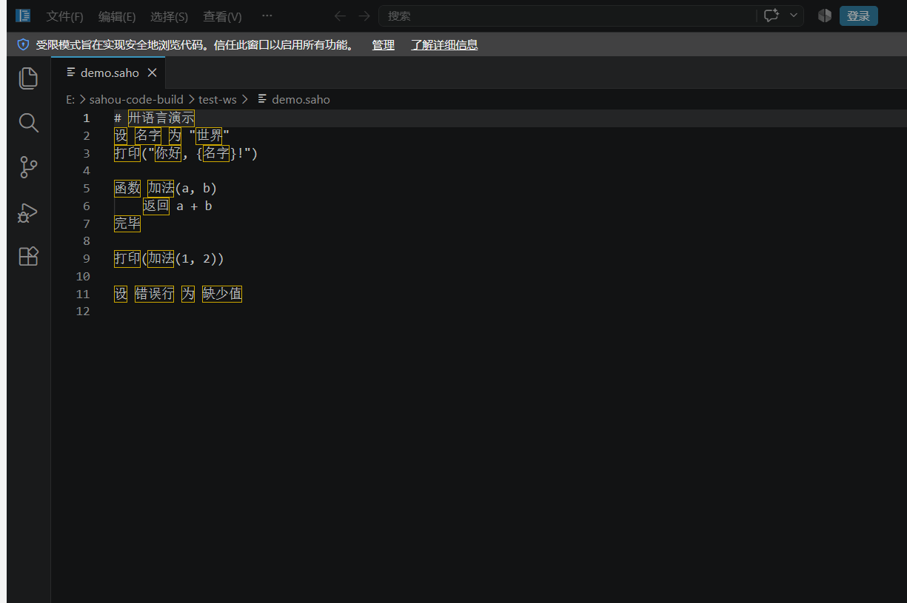
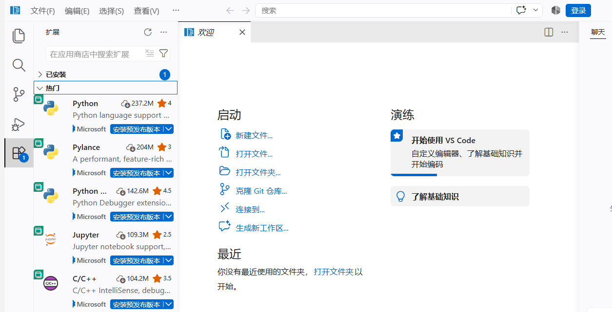

# 卅码 Shaoma Code

**基于 VS Code 开源版深度定制的中文编程开发环境，原生内置 [卅（sahou）语言](https://github.com/gwqwy/sahou) 支持，开箱即用。**





## 这是什么

[卅（sahou）](https://github.com/gwqwy/sahou)是一门比 Python 更简单的中文入门编程语言：
`.saho` 源文件、Go 实现的解释器、自带 LSP 与格式化器。

**卅码**基于 [microsoft/vscode](https://github.com/microsoft/vscode) 开源源码（v1.139.0）构建，
把卅语言支持做成了**产品内置扩展**，并默认简体中文界面——下载解压即可写卅程序，
无需安装任何插件、无需配置解释器路径。

## 特性

- **卅语言全支持**：双语关键字/内置函数/模块语法高亮、`卅`文件图标、代码片段
- **实时诊断与补全**：内置解释器的 `lsp` 子命令提供双语错误波浪线与补全
- **一键运行**：`Alt+S` / 编辑器 ▶ 按钮 / `Ctrl+Shift+B` 在集成终端运行当前 `.saho` 文件
- **文档格式化**：`Shift+Alt+F` 调用解释器格式化
- **默认简体中文**：首次启动即中文界面（官方简体中文语言包内置，可切换回英文）
- **扩展市场可用**：已配置连接微软官方扩展市场，Python/C++/GitLens 等海量扩展直接搜索安装
- **便携化**：`data/` 目录自包含全部数据，整个文件夹拷走即迁移
- **一键运行**之外，其余功能与开源版 VS Code 完全一致：调试、Git、终端、远程开发等均未改动

## 下载

前往 [Releases](../../releases) 页面下载 `ShaomaCode-win32-x64-portable.zip`，
解压后双击 `卅码.exe` 即可（Windows 10/11 x64）。

## 快速开始

1. 新建 `你好.saho`，输入：

   ```
   # 我的第一个卅程序
   设 名字 为 "世界"
   打印("你好, {名字}!")
   ```

2. 按 `Alt+S` 运行，集成终端输出 `你好, 世界!`
3. 故意写错试试（比如删掉一个引号），解释器会给出**双语错误提示**和波浪线

## 从源码构建

见 [docs/BUILD.md](docs/BUILD.md)。核心三步：

```powershell
# 1. 获取源码并应用定制补丁（本仓库 patches/ 目录）
git clone --depth 1 https://github.com/microsoft/vscode.git
cd vscode
git apply ..\sahou-code\patches\*.patch

# 2. 放入内置扩展与品牌资源（见 docs/CUSTOMIZATIONS.md 的目录清单）

# 3. 构建便携版
npm install
npm run gulp vscode-win32-x64
```

`scripts/build.ps1` 一键完成上述全部步骤。

## 仓库结构

```
├── README.md                 本文件
├── LICENSE                   MIT 许可证（继承上游）
├── extension/                卅语言内置扩展源码（独立可复用）
│   ├── package.json          语言/命令/配置声明
│   ├── extension.js          LSP 客户端 + 运行命令 + 补全/悬停/格式化
│   ├── syntaxes/             TextMate 语法
│   ├── snippets/             代码片段
│   └── language-configuration.json
├── patches/                  对上游 vscode 源码的全部修改（git apply 即可）
├── assets/branding/          卅码图标与卅语言 logo
├── scripts/                  一键构建与打包脚本
├── docs/                     构建指南、修改清单、截图
└── release-assets/           本地构建的便携版压缩包
```

## 定制内容一览

| 修改 | 文件 | 说明 |
|---|---|---|
| 内置卅语言扩展 | `extensions/sahou/`（新增） | 高亮/诊断/补全/运行/格式化，内置解释器 |
| 内置简体中文语言包 | `extensions/vscode-language-pack-zh-hans/`（新增） | 来自 [microsoft/vscode-loc](https://github.com/microsoft/vscode-loc) |
| 默认简体中文界面 | `src/main.ts` | 首次启动生成的 `argv.json` 写入 `"locale": "zh-cn"` |
| 关闭 Copilot 首启引导向导 | `gettingStarted.contribution.ts` | `workbench.welcomePage.experimentalOnboarding` 默认 `false` |
| 品牌与扩展市场 | `product.json` | 产品名"卅码"、定制图标、`extensionsGallery`、恢复 `defaultChatAgent` |

完整差异见 [docs/CUSTOMIZATIONS.md](docs/CUSTOMIZATIONS.md)。

## 许可证

[MIT](LICENSE)。基于 [microsoft/vscode](https://github.com/microsoft/vscode)（MIT，
Copyright (c) Microsoft Corporation）与 [gwqwy/sahou](https://github.com/gwqwy/sahou)（MIT）构建。
卅码名称与定制图标不属于微软官方产品。

## 致谢

- [microsoft/vscode](https://github.com/microsoft/vscode) — 最好的开源编辑器
- [gwqwy/sahou](https://github.com/gwqwy/sahou) — 卅语言及其自带的 VS Code 扩展
- [microsoft/vscode-loc](https://github.com/microsoft/vscode-loc) — 官方简体中文语言包
